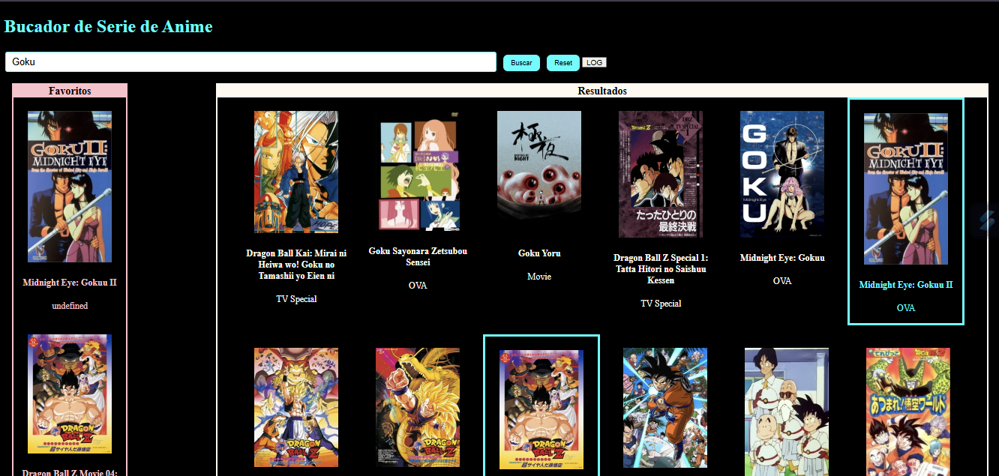

# 🎌 Evaluación Final - Módulo 2 | Promo 53 - Adalab

Aplicación web desarrollada como evaluación final del Módulo 2 del bootcamp de Adalab.  
Permite buscar series de anime, marcarlas como favoritas y guardarlas en `localStorage`. Todo el proyecto ha sido realizado usando HTML, Sass y JavaScript vanilla.

---

## 🔍 ¿Qué hace esta app?

- Permite buscar series de anime mediante la API de Jikan.
- Muestra los resultados con imagen y título.
- Puedes marcar series como favoritas.
- Guarda tus favoritas en el almacenamiento local (localStorage).
- Las favoritas se mantienen aunque recargues la página.
- Puedes eliminar favoritas una a una o todas a la vez.
- Tiene un botón de "reset" para limpiar búsqueda y favoritos.
- Incluye diseño responsive y maquetación personalizada con Sass.

---

## ✨ Funcionalidades implementadas

✅ Buscar series de anime  
✅ Mostrar resultados con imagen y título  
✅ Marcar/desmarcar favoritas  
✅ Listado de favoritas persistente  
✅ Guardado en `localStorage`  
✅ Eliminar favoritas individualmente  
✅ Eliminar todas las favoritas  
✅ Reset general (input, resultados, favoritas)  
✅ Maquetación responsive con Sass

---

## 🧠 Tecnologías utilizadas

- HTML5
- Sass (con starter kit de Adalab)
- JavaScript (vanilla)
- Fetch API
- Git y GitHub
- GitHub Pages

---

## ⚙️ Cómo instalar y ejecutar el proyecto

Este proyecto utiliza [Vite](https://vitejs.dev/) y el starter kit de Adalab.

### 1. Clonar el repositorio

```bash
git clone https://github.com/Roxana-Solano/proyecto-evaluacion-modulo2.git
cd nombre-del-repo
```

### 2. Instalar dependencias

```bash
npm install
```

### 3. Ejecutar en modo desarrollo

```bash
npm run dev
```

### 4. Crear version para producción

```bash
npm run build
```

### 4. Publicar en GitHub Pages

```bash
npm run deploy
```

---

## 🔍 Requisitos:

- Tener Node.js instalado.

- Tener Git configurado en tu equipo.

---

## 📸 Vista previa



---

## 📁 Estructura del proyecto

El proyecto está estructurado con el starter kit de Adalab, incluyendo:

- `src/` → archivos fuente (HTML, Sass, JS)

- `public/` → favicon y otros recursos

- `docs/` → carpeta para GitHub Pages

---

## 📚 Aprendizajes clave

- Uso de APIs con fetch y promesas.

- Manipulación del DOM con JavaScript.

- Almacenamiento de datos con localStorage.

- Condicionales, eventos, arrays y funciones.

- Diseño responsive con Flexbox y Sass.

- Organización de código en módulos.

---

## 🧪 Estado del proyecto

✅ **Finalizado**  
📦 Publicado en GitHub Pages → [Ver demo](https://roxana-solano.github.io/proyecto-evaluacion-modulo2/)

---

## 🙋‍♀️ Autoría

Realizado por **Roxana Solano** como parte del bootcamp de Adalab — Promo 53.

---
